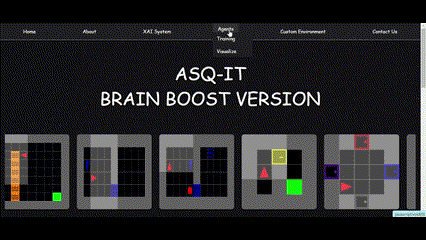
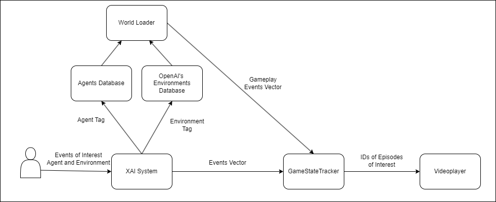
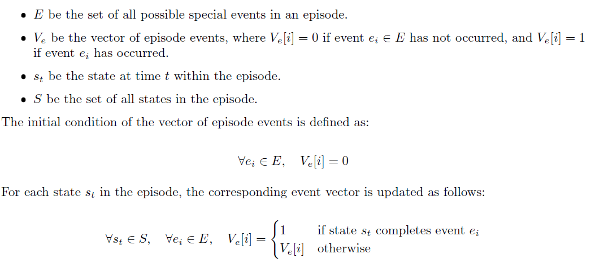

# Project Overview

This project is part of a BSc thesis at the University of Haifa, aimed at developing an interactive tool for predicting and analyzing agent behavior in both virtual and real-world environments. The tool allows users to simulate and analyze temporal behaviors or events and provides video outputs based on specific behavioral scenarios described through textual queries. It can be used in fields such as reinforcement learning, AI, and agent behavior prediction.


## INSTALLATION
1. Clone the repository
```python
git clone https://github.com/ItsRamiz/eXplainableAI.git
```
```python
pip install -r requirements.txt
```
2. For Windows Support, Navigate to Installation_Guide and replace your environment penv.py file with the one specified. (Remove Comments).

3. For Linux Support, Follow the continued installation guidelines in installation1.txt

## Feature 1: Customizable Agent Training with Reinforcement Learning

The tool provides users the ability to train reinforcement learning agents using either predefined or fully customizable parameters, allowing for fine-tuned control over the training process using the PPO (Proximal Policy Optimization) algorithm. Users can adjust the following parameters:

- **Seed**: Initialize the training with a specific seed for reproducibility.
- **Number of Processes**: Specify the number of parallel processes for faster training.
- **Number of Frames**: Set the total number of frames used during training.
- **Epochs**: Define how many full passes the model makes over the training data.
- **Batch Size**: Control the number of samples processed before updating the model.
- **Discount Factor**: Set the discount rate for future rewards (γ).
- **Learning Rate**: Specify the step size for gradient updates.
- **Entropy Coefficient**: Adjust the exploration-exploitation tradeoff.
- **Adam Optimizer Epsilon**: Set the epsilon parameter for stability in the Adam optimizer.
- **RMSprop Optimizer Alpha**: Control the smoothing factor for the RMSprop optimizer.
- **Number of Backsteps to Propagate**: Set how many steps back in time the algorithm looks when updating the agent's actions.
- **Max Norm of Gradient**: Prevent gradient explosion by setting a maximum allowable norm for gradients.

To initiate training manually, the following command is used:
'python -m scripts.train --algo ppo --env (envName) --model (modelName) ParametersValues'

You can add any parameter mentioned above:

Example:
'python -m scripts.train --algo ppo --env MiniGrid-LavaCrossingS9N1-v0 --model LavaCrossing --save-interval 100 --frames 10000000 --lr 0.0001 --batch-size 1024 --epochs 10 --frames-per-proc 128 --discount 0.99 --gae-lambda 0.95 --entropy-coef 0.01 --value-loss-coef 0.5 --max-grad-norm 0.5 --clip-eps 0.2 --procs 16'

Any parameters that we are not included in the command are replaced by a default value. (You can edit the default values in train.py).

This feature enables researchers to experiment with different configurations and explore a variety of agent behaviors in different environments.

## Feature 2: Graphical Visualization of Agent Behavior

This feature provides visualizations of the agent's behavior across various environments. Users can observe how agents respond to different stimuli in real-time or review recorded behaviors after training.

Visualizations include:

- Agent Movements: Tracking paths and decision-making processes.
- Interactions: Visualizing interactions with objects, obstacles, or other agents.
- Behavioral Insights: Key moments such as when agents succeed, fail, or adapt.

Here’s how the feature works:

1. Select an environment from MiniGrid.
2. Select a pre-trained or self-traine agent.
3. View the agent's behavior in real-time.

This works by capturing every frame and building a video in the format of .mp4.

All videos are saved in Project Directory/static/videos.




## Feature 3: XAI System (Explainable AI System)

The XAI System (Explainable AI System) is designed to help users better understand agent behaviors by making reinforcement learning outcomes more interpretable. Using explainability techniques, the system provides a clear and user-friendly interface that allows researchers, developers, and educators to explore and analyze how agents make decisions in different environments. This bridges the gap between complex AI algorithms and human understanding, making it easier to gain valuable insights from agent-environment interactions.


### Key Capabilities of the XAI System

- **Agent and Environment Selection**: The system offers users the freedom to select from a broad selection of agents, each with unique behaviors and learning patterns. Additionally, users can choose from a wide range of predefined **MiniGrid environments**—virtual worlds designed to simulate various challenges and tasks. Whether it’s a simple maze or a more complex puzzle environment, the system provides rich scenarios for the agent to navigate, allowing for diverse and nuanced behavior analysis.

- **Customizable Event Queries**: One of the most innovative aspects of the XAI System is the ability to customize event queries. Users can define a range of events they are interested in, such as an agent finding a key, avoiding an obstacle, or reaching a specific goal. The system accommodates a variety of behaviors, from routine interactions to rare occurrences, making it highly adaptable to different research or project needs.

- **Episode Retrieval**: Once the user defines the agent, environment, and events of interest, the XAI System processes the data and identifies all relevant episodes where the specified events occurred. These episodes provide a comprehensive view of the agent's decision-making process during critical moments, offering users a granular look into the agent's performance.

- **Video Output and Analysis**: The system doesn’t just provide raw data—it returns full video outputs of the episodes where the selected events took place. This feature enables users to visually analyze how and why agents acted in specific ways during key moments. By reviewing these videos, users can detect patterns, assess the effectiveness of training, and gain a clearer understanding of the agent's thought process. Whether it’s for research, education, or AI model validation, these videos are instrumental in making agent behavior interpretable and accessible.

[Watch the video](static/images/ReadMe/XAI_VIDEO.mp4)

### Unified Environment Structure with GameStateTracker

The project uses a generic code structure that supports all environments, ensuring efficiency and consistency while allowing flexibility for different agent behaviors and events.

Central to this system is the GameStateTracker, which tracks each episode in real-time. It logs key events, agent actions, and environmental changes, ensuring accurate data collection. This tracking is crucial for the XAI System, as it identifies user-defined events and helps retrieve the exact video segments for analysis.

By integrating the GameStateTracker with a unified environment structure, the system ensures precise video outputs that focus on relevant events, making it robust and adaptable for various scenarios.

You can edit the implementation and add to the GameStateTracker a function that checks new conditions which returns 1 or 0 if the condition is met, and by that a new condition is tested.



You can add a new environment and implement a GameStateTracker by heading over to the environments/environment_template.py where a default template which is seperated by 3 parts, the first part handles the input from the HTML page, the second is loop where the episode runs and the last is the "SAVING VIDEOS" which saves the requested videos.

def checkGameState receives all the parameters required to check if the episode is desired, return 1 if all the conditions needed are met.



### Video Clipping for Efficiency

To improve the efficiency of the visualization process, the project offers a video clipping feature. If episodes result in videos that are too long, users can opt to receive shorter clips that focus on the key moments where the specified events occurred, instead of reviewing the entire video.

This feature allows users to quickly and efficiently analyze agent behavior without having to sift through lengthy recordings. It’s particularly useful for large-scale studies or when analyzing multiple episodes, streamlining the process and enhancing the overall user experience.


## Feature 4: Custom-Made Environments

To overcome the limitations of pre-made MiniGrid environments, we've introduced the ability for users to create custom environments. This feature gives users full control over the environment's design, allowing them to adjust elements like map size, objects, obstacles, and goals to suit specific scenarios or research needs. It provides a flexible platform for experimenting with new environments and challenges, making it a powerful tool for exploring agent behavior in diverse conditions.

Users can also train agents in these custom environments using reinforcement learning with adjustable parameters. This feature adds flexibility to the system, enabling unique environments and tailored training experiences.


### Key Customization Options

- **Map Size**: Users can define the dimensions of the environment, adjusting it to suit different scales of complexity and exploration.
  
- **Lava**: Add or remove lava tiles to create hazards that agents must navigate around or avoid, adding a layer of difficulty and strategic challenge.

- **Keys and Key Colors**: Users can place keys within the environment and choose their colors. This adds variety to agent-object interaction and can be used to create more complex puzzles and tasks.

- **Locked/Unlocked Doors**: Set up doors that require agents to unlock them using specific keys, creating more advanced task sequences and introducing dependencies between objects and rewards.

- **Goals**: Define the end goals for the agent, whether it's reaching a specific location, collecting an object, or triggering a certain event. These goals help shape the agent’s learning process and influence its behavior within the environment.

The custom environments are fully compatible with all the features above provided by the system.

One-click to add a new object to the selected block in the mapping, double-click to remove the selected block.

## Upcoming Features

As part of our ongoing commitment to expanding and improving the capabilities of the project, several exciting features are planned for future updates. These additions aim to enhance the agent’s functionality, increase flexibility for the user, and expand the range of environments the system can handle.

### 1. Enhanced Text Understanding with LLM Integration

Currently, the agent has a basic understanding of text-based inputs, but we plan to enhance this by integrating a Large Language Model (LLM). This upgrade will enable the agent to process more complex user commands, allowing for natural language interaction.

Instead of relying solely on predefined options for environment settings, event queries, and actions, users will soon be able to input text or speech commands. The LLM will interpret these inputs, offering a more intuitive and flexible way to interact with the system. This feature aims to make creating environments, training agents, and querying events more seamless and user-friendly.

### 2. More Diverse and Sparse Reward System

A limitation of existing MiniGrid environments is the simplicity of their reward systems. To address this, we are developing a sparse rewards system that will offer more diverse ways of allocating rewards.

This system will support more advanced reinforcement learning by rewarding not just goal achievement, but also factors like efficiency, exploration, and interactions with specific objects. These richer reward structures will enable users to train agents for more complex, real-world tasks, moving beyond the rigid constraints of traditional environments.

### 3. Custom Objects with Custom Behaviors

In future updates, we plan to introduce the ability to create and add custom objects to environments. These objects will have unique behaviors and properties, opening up new possibilities for both research and practical use.

As we continue to explore OpenAI’s MiniGrid code, we are making progress toward this feature. Users will be able to add objects with specific roles, such as tools, obstacles, or interactive elements, expanding beyond the standard MiniGrid objects. This will allow for the creation of more complex and realistic environments, further advancing agent training capabilities.

### 4. Expansion to Real-Life Environments

While the current system focuses on virtual environments, we are working to expand it into real-life environments. By leveraging advancements in computer vision, image processing, and reinforcement learning, we aim to create a framework that allows agents to operate in physical spaces.

This feature will be valuable for real-world applications such as robotics, autonomous systems, and AI-driven decision-making. By enabling agents to perceive and interact with the real world, the system could be applied across industries like manufacturing and autonomous driving, bridging the gap between virtual simulations and practical, real-world AI applications.

## References and Acknowledgments

This project would not have been possible without the contributions and resources provided by various individuals and organizations. We would like to extend our thanks to the following:

1. **OpenAI Documentation**: For providing access to a comprehensive range of open-source tools, libraries, and educational resources that played a crucial role in the development of this project.

2. **The Team at University of Haifa and The Technion**: A special thank you to our collaborators and colleagues from both institutions, whose expertise and partnership were instrumental in making this project a reality.

3. **Research Resources**: 
   - [OpenAI Research on Explainable AI](https://arxiv.org/abs/2301.09941) 
   - [IEEE Xplore - Reinforcement Learning in Robotics](https://ieeexplore.ieee.org/document/9372847)

4. **Lucas Williams**: For his outstanding contributions to the fundamentals of reinforcement learning algorithms, which greatly informed and influenced the direction of this project.


## Contact Us
If you have any suggestions, feedback, or inquiries regarding this project, please feel free to reach out to us. We highly value your input and look forward to hearing your thoughts.
- Aisha Abu dahesh: aishadahesh11@gmail.com
- Ramiz Srour: ramiz.srour1@gmail.com


